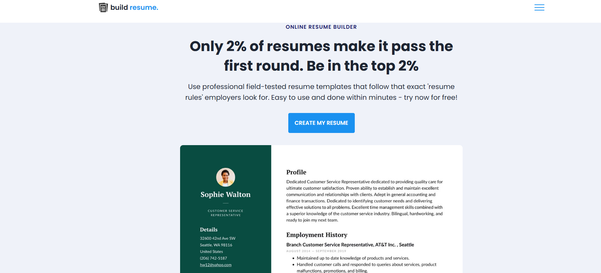

# Resume Generator - Simple Resume Creation Tool
# Overview
The Resume Generator is an easy-to-use web application designed to help users create professional resumes quickly and efficiently. Users can input their details such as personal information, education, work experience, and skills. This project aims to provide a hassle-free way to generate customized resumes that can be easily downloaded or printed.
Built using HTML, CSS, and JavaScript, this project offers an intuitive interface with a simple, clean design for users to input their information and download their resumes instantly.
# Live Website
You can view the live demo of the Resume Generator here:

• Live Website Link: [Resume Generator](https://meghana315.github.io/Resume-Generator)

# Features
• User-friendly interface: Clean and simple design for easy resume creation.

• Personal Information Form: Users can input their name, contact details,and personal summary.

• Education Section: Allows users to add their educational qualifications.

• Work Experience Section: Users can input details about their previous jobs and roles.

• Skills Section: Add relevant skills for the resume.

• Download/Print Resume: After generating the resume, users can easily download it as a PDF or print it directly.

• Responsive design: The app is responsive and works well on mobile, tablet, and desktop.
# Technologies Used 
- HTML
- CSS
- JavaScript (Vanilla)

